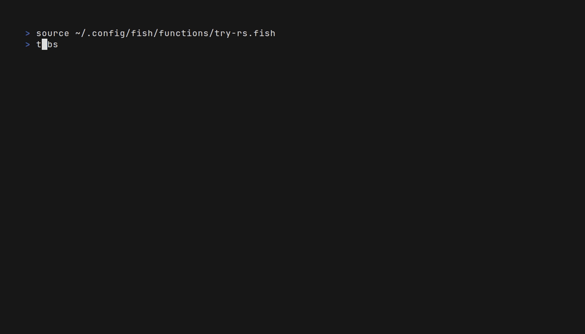

<p align="center">
  
</p>

<p align="center">
<a href="https://try-rs.org">try-rs.org</a>
<br>
A blazing fast, Rust-based workspace manager for your temporary experiments.
<br>
</p>

<p align="center">
  
  
  <a href="https://github.com/tassiovirginio/try-rs">
    
  </a>
  <a href="https://aur.archlinux.org/packages/try-rs-bin">
    
  </a>
</p>


**try-rs** is a CLI tool designed to manage the chaos of temporary projects. Instead of cluttering your Desktop or `/tmp` with `test1`, `new-test`, and `final-test`, `try-rs` organizes them into date-prefixed directories, offering a robust TUI (Terminal User Interface) to create, navigate, and clean up your experiments.



## Features

| Feature                     | Description                                                                            |
| :-------------------------- | :------------------------------------------------------------------------------------- |
| **Blazing Fast**         | Built in Rust, compiled to native binary. No interpreter lag.                          |
| **Rich TUI**             | Beautiful terminal interface built with [Ratatui](https://github.com/ratatui/ratatui). |
| **Fuzzy Search**         | Instantly find old experiments with smart matching.                                    |
| **Auto-Dating**          | Creates directories like `rust-test` automatically.                                    |
| **Git Integration**       | Auto-clones URLs (`try-rs <url>`) and marks repos with ().                            |
| **Content Preview**      | Inspect files inside a folder before entering it.                                      |
| **Editor Integration**   | Open experiments directly in your editor (`Ctrl+E`).                                   |
| **Theming**              | Switch themes at runtime (`Ctrl+T`) or customize via config.                           |
| **Safe Deletion**        | Delete old experiments via UI with confirmation (`Ctrl+D`).                            |
| **Configurable**         | Supports XDG Base Directory (view section [Configuration](#configuration)).            |
| **Multi-Shell Support**  | Supports Fish, Zsh, Bash, Power Shell and Nushell.                                     |
| **Multi-OS Support**     | Supports Linux, macOS and Windows.                                                     |
| **Icons Identification** | Supports icons identification projects (` 󰬔     `).                              |

## Installation

### Prerequisites

- A shell (Fish, Zsh, Bash, Power Shell or Nushell).
- A **Nerd Font** installed (required for icons like  and 🦀).

### Building from source

```bash
git clone [https://github.com/tassiovirginio/try-rs.git](https://github.com/tassiovirginio/try-rs)
cd try-rs
cargo install --path . --bin try-rs
```

### Cargo install try-rs

```bash
cargo install try-rs
```

### Install in Archlinux

```bash
yay -S try-rs-bin
```

### Nix Install (flakes)

```bash
nix profile install github:tassiovirginio/try-rs
```

### Automatic Setup

On the first run, **try-rs** will attempt to detect your shell and ask if you want to automatically configure the shell integration.

## Configuration

1. Setup the Shell Integration

Since try-rs needs to change your shell's current directory, it requires a small wrapper function.

- Fish Shell (Recommended)

```bash
try-rs --setup fish
```

(Optional) Create an abbreviation:

```
abbr --add try try-rs
```

- Zsh

```bash
try-rs --setup zsh
```

- Bash

```bash
try-rs --setup bash
```

- Power-shell

```bash
try-rs --setup power-shell
```

- Nushell

```bash
try-rs --setup nu-shell
```

### 2. Config File

The configuration file is stored in a platform-specific directory:

| Platform    | Value                                 | Example                                                    |
| :---------- | :------------------------------------ | :--------------------------------------------------------- |
| **Linux**   | `$XDG_CONFIG_HOME` or `$HOME/.config` | `/home/tassiovirginio/.config/try-rs`                      |
| **macOS**   | `$HOME/Library/Application Support`   | `/Users/tassiovirginio/Library/Application Support/try-rs` |
| **Windows** | `{FOLDERID_RoamingAppData}`           | `C:\Users\tassiovirginio\AppData\Roaming\try-rs`           |

By default, experiments are stored in `~/work/tries`. You can customize the path and the UI colors (themes). To change this, create `config.toml` in the directory shown above:

```toml
# config.toml
tries_path = "~/Development/playground"
editor = "code" # Optional: code, nvim, hx, etc.

[colors]
title_try = "Magenta"
title_rs = "White"
search_box = "Green"
list_date = "Blue"
list_highlight_bg = "Magenta"
list_highlight_fg = "Black"
help_text = "DarkGray"
status_message = "Yellow"
popup_bg = "DarkGray"
popup_text = "LightRed"
```

### 3. Environment Variables

You can also configure **try-rs** using environment variables:

| Variable            | Description                                                |
| :------------------ | :--------------------------------------------------------- |
| `TRY_PATH`          | Overrides the path where experiments are stored.           |
| `TRY_CONFIG_DIR`    | Overrides the default configuration directory.             |
| `TRY_CONFIG`        | Overrides the config filename (defaults to `config.toml`). |
| `VISUAL` / `EDITOR` | Default editor to use if not specified in `config.toml`.   |

## Usage

Simply type try-rs (or your alias) in your terminal.

### Key Bindings

| Key                                                   | Action                                                 |
| ----------------------------------------------------- | ------------------------------------------------------ |
| `Type`                                                | Filter the list (Fuzzy Search)                         |
| `↑` / `↓` / `Ctrl+K` / `Ctrl+J` / `Ctrl+P` / `Ctrl+N` | Navigate the list                                      |
| `Ctrl+U`                                              | Clear the search box                                   |
| `Enter`                                               | Select directory (or create new if text doesn't match) |
| `Ctrl+D`                                              | Delete the selected directory (triggers popup)         |
| `Ctrl+E`                                              | Open in editor (configured in config.toml)             |
| `Ctrl+T`                                              | Open theme selector                                    |
| `Ctrl+A`                                              | Open about popup                                       |
| `Esc/Ctrl+C`                                          | Cancel / Close Popup / Exit                            |

#### Theme Selector Key Bindings

| Key                               | Action               |
| --------------------------------- | -------------------- |
| `↑` / `↓` / `j` / `k` / `n` / `p` | Navigate themes      |
| `Enter`                           | Select theme         |
| `Esc/Ctrl+C`                      | Close theme selector |

## Themes

You can switch between themes at runtime by pressing `Ctrl+T`. The following themes are available:

- **Catppuccin Mocha** (Default)
- **Dracula**
- **JetBrains Darcula**
- **Gruvbox Dark**
- **Nord**
- **Tokyo Night**

You can also define a custom theme in your `config.toml`.

## CLI Commands

You can also bypass the UI:

| Command                                        | Description                                                      |
| ---------------------------------------------- | ---------------------------------------------------------------- |
| `try-rs`                                       | Opens the TUI                                                    |
| `try-rs <name>`                                | Create (or jump to) a named experiment                           |
| `try-rs <https://github.com/user/repo>`        | Clones a repository into a dated folder                          |
| `try-rs <https://github.com/user/repo> <name>` | Clones a repository into a specific folder name                  |
| `try-rs -s <url>`                              | Shallow clone (depth 1)                                          |
| `try-rs --setup <shell>`                       | setup shell integration (fish, zsh, bash, power-shell, nu-shell) |
| `try-rs --version`                             | Show application version                                         |
| `try-rs --help`                                | Show help message                                                |

## Inspiration

This project is a Rust port and re-imagination of the excellent [try](https://github.com/tobi/try) tool by **Tobi Lütke**.

While the original is a lightweight Ruby script, **try-rs** aims to bring the same philosophy, "Your experiments deserve a home", but with the performance, type safety, and modern TUI capabilities (using [Ratatui](https://github.com/ratatui/ratatui)) of the Rust ecosystem.

## Contributing

Pull requests are welcome! For major changes, please open an issue first to discuss what you would like to change.

📄 License
[MIT](LICENSE)
